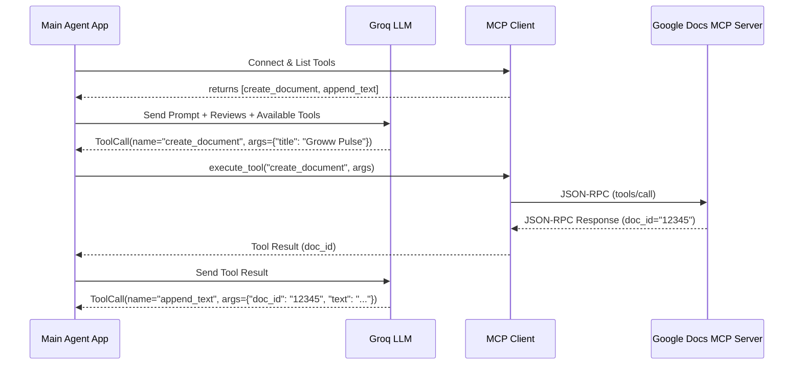

# 🏛️ Groww App Review Analyst — Architecture

## 1. System Overview
The Groww App Review Analyst is an automated, agentic pipeline designed to extract, analyze, and report on mobile application reviews. It leverages the **Model Context Protocol (MCP)** to interact with external services (Google Docs, Gmail) securely and uniformly, abstracting away direct API complexities.

This system operates entirely locally or on a secure cloud instance, utilizing **Groq**-hosted LLMs (e.g., `llama-3.3-70b-versatile` or `mixtral-8x7b-32768`) capable of function calling to dynamically write Google Docs and draft Gmail messages via standardized MCP JSON-RPC protocols. Groq's ultra-low-latency inference engine enables rapid batch processing of large review datasets.

## 2. High-Level Architecture & Data Flow

```mermaid
graph TD
    %% Core Inputs
    A[Raw Play/App Store CSV] -->|Ingestion| B(Data Ingestion & Sanitizer)
    
    %% Sanitization Output
    B -->|Cleaned JSON Array| C{Review Analyst Agent <br> Core LLM Loop}
    
    %% Agent Loop
    subgraph Agent Loop & Context
        C -->|1. Thematic Analysis| C
        C -->|2. Quote Extraction| C
        C -->|3. Idea Generation| C
    end
    
    %% MCP Boundary
    subgraph Model Context Protocol (MCP) Integration
        C -->|JSON-RPC Request: call_tool 'create_document'| D[Google Docs MCP Server]
        D -->|JSON-RPC Response: Doc ID| C
        C -->|JSON-RPC Request: call_tool 'append_text'| D
        
        C -->|JSON-RPC Request: call_tool 'create_draft'| E[Gmail MCP Server]
        E -->|JSON-RPC Response: Draft ID| C
    end
    
    %% External World
    D -->|Google API| F[(Google Drive)]
    E -->|Google API| G[(Gmail)]
```

## 3. Core Components & Technical Specifications

### A. Data Ingestion & Sanitization Layer
*   **Role:** The entry point of the application. Reads raw exports spanning 8-12 weeks.
*   **Tech Stack:** Python, native `csv`/`json` libraries.
*   **Data Schema (Input):** `{"review_id": str, "rating": int, "title": str, "text": str, "date": date}`
*   **Sanitization Rules:**
    *   Strip numbers matching phone formats.
    *   Strip strings matching email regex.
    *   Filter out empty reviews or reviews with < 3 words.

### B. Core LLM Agent (The Analyst)
*   **Role:** The orchestrator and brain of the system. Runs the ReAct (Reasoning and Acting) loop or standard tool-calling loop.
*   **Tech Stack:** Python, `groq` Python SDK (Groq Cloud API).
*   **LLM Provider:** [Groq](https://groq.com/) — ultra-low-latency inference platform.
    *   **Model:** `llama-3.3-70b-versatile`.
    *   **API Key:** Stored in `.env` as `GROQ_API_KEY`.
    *   **Rate Limits (Free Tier):**

        | Limit | Value |
        |---|---|
        | Requests / minute | 30 |
        | Requests / day | 1,000 |
        | Tokens / minute | 12,000 |
        | Tokens / day | 100,000 |
*   **Capabilities:**
    *   **Thematic Analysis:** Classifies hundreds of reviews into a maximum of 5 core themes (e.g., KYC, UPI, UI/UX).
    *   **Summarization:** Extracts real user quotes and synthesizes 3 actionable product ideas.
    *   **Tool Calling:** Analyzes the output requirement, requests available tools from MCP clients, and formats JSON arguments to execute them autonomously.

### C. MCP Client Layer
*   **Role:** The bridge between the LLM Agent and the MCP Servers.
*   **Tech Stack:** `mcp` Python SDK (Model Context Protocol official SDK).
*   **Protocol:** Communicates with local MCP servers over `stdio` (Standard IO).
*   **Lifecycle:**
    1. `initialize` connection.
    2. `tools/list` to fetch available capabilities.
    3. `tools/call` triggered by the LLM.

### D. MCP Servers
*   **Google Docs MCP Server:** 
    *   *Implementation:* Node.js or Python process running the MCP Server SDK and holding Google OAuth credentials.
    *   *Tools Exposed:* `create_document(title)`, `append_text(document_id, text)`.
*   **Gmail MCP Server:**
    *   *Implementation:* Similar to Google Docs, holding Gmail scopes.
    *   *Tools Exposed:* `create_draft(to, subject, body_html)`.

## 4. Sequence Diagram: Tool Execution



## 5. Data Pre-Processing & Rate-Limit-Aware LLM Call Strategy

The tightest constraint is **12,000 tokens/minute**. The raw dataset (~38K tokens) cannot be sent in a single call. The strategy below reduces data aggressively *before* the LLM and splits analysis into batched calls that respect every Groq limit.

### 5.1 Raw Dataset Profile

| Metric | Value |
|---|---|
| Total reviews (post-Phase 1) | 1,663 |
| Avg. review length | ~92 chars (~23 tokens) |
| Max review length | 500 chars |
| Total corpus tokens | ~38K |
| Rating distribution | ⭐1: 488 (29%) · ⭐2: 69 · ⭐3: 83 · ⭐4: 152 · ⭐5: 871 (52%) |

### 5.2 Pre-Processing Pipeline (Zero LLM Calls)

All steps below run in pure Python *before* any Groq API call:

1.  **Low-Signal Filter:** Remove reviews with < 5 words or matching a generic-positive pattern list (`"good app"`, `"nice"`, `"best"`, `"easy to use"`, etc.). Eliminates ~40% of 5-star noise.
2.  **Spam & Gibberish Filter:** Drop reviews where >50% of characters are uppercase and no actionable keywords are present (catches all-caps rants, promotional spam).
3.  **Rating-Stratified Selection:** Keep **all** 1–2 star reviews (richest actionable content). From 3–5 star reviews, keep only those with ≥ 10 words (substantive feedback). This reduces the corpus to **~400 actionable reviews**.
4.  **Language Normalization:** The dataset contains English, Hindi, Hinglish, and Marathi. No translation is performed — the system prompt instructs the LLM to treat all languages equally but output the final report in English.

**Post-filter estimate:** ~400 reviews × ~38 tokens avg = **~15,000 tokens** of review content.

### 5.3 Batched LLM Call Plan (3 Calls Total)

The analysis is split into a **2-pass architecture** to stay within the 12K TPM limit:

```
┌─────────────────────────────────────────────────────────────────────┐
│  PASS 1 — Batch Analysis (2 calls, 60s apart)                     │
│                                                                     │
│  Batch A: Reviews 1–200    ──► Groq ──► partial_themes_A.json      │
│       (wait ≥ 60 seconds)                                           │
│  Batch B: Reviews 201–400  ──► Groq ──► partial_themes_B.json      │
│                                                                     │
├─────────────────────────────────────────────────────────────────────┤
│  PASS 2 — Synthesis (1 call, 60s after Pass 1)                     │
│                                                                     │
│  Merge partial_themes_A + partial_themes_B                          │
│       ──► Groq ──► final_report.json                               │
│       (themes ≤ 5, quotes = 3, ideas = 3, body ≤ 250 words)       │
└─────────────────────────────────────────────────────────────────────┘
```

### 5.4 Token Budget Per Call

| Call | Input Tokens | Output Tokens | Total | Spacing |
|---|---|---|---|---|
| **Batch A** (200 reviews) | ~8,100 (7,600 reviews + 500 prompt) | ~1,500 | ~9,600 | — |
| **Batch B** (200 reviews) | ~8,100 | ~1,500 | ~9,600 | ≥ 60s after A |
| **Synthesis** (merge 2 partials) | ~3,500 (2 partial JSONs + 500 prompt) | ~1,500 | ~5,000 | ≥ 60s after B |
| **Total per run** | **~19,700** | **~4,500** | **~24,200** | ~3 min |

**Limit compliance:**
*   ✅ **12K TPM:** Each call ≤ 10K tokens, with 60s spacing between calls.
*   ✅ **30 RPM:** Only 3 requests in ~3 minutes (1 req/min).
*   ✅ **100K TPD:** ~24K tokens/run allows **4 full runs per day** with headroom.
*   ✅ **1K RPD:** 3 requests/run × 4 runs = 12 requests — well within 1,000.

### 5.5 Rate Limiter Implementation

*   A `rate_limiter.py` module wraps all Groq API calls with:
    *   **Token counting** (pre-flight): Uses `tiktoken` or simple char/4 heuristic to estimate tokens before sending.
    *   **Minimum 60-second spacing** between consecutive calls via `time.sleep()`.
    *   **Exponential backoff** on `429 Too Many Requests` (retry after `Retry-After` header, max 3 retries).
    *   **Daily budget tracker**: Logs cumulative tokens used; aborts if approaching 90K threshold.

## 6. Security & Compliance
*   **Zero PII Leakage:** The ingestion layer drops all user IDs before the payload is sent to the Groq LLM.
*   **Decoupled Auth:** The Agent logic has **zero access** to Google API keys or OAuth tokens. It only communicates via standard MCP protocols. The host machine running the MCP server is responsible for securing the environment variables (e.g., `.env` containing OAuth client secrets and `GROQ_API_KEY`).
