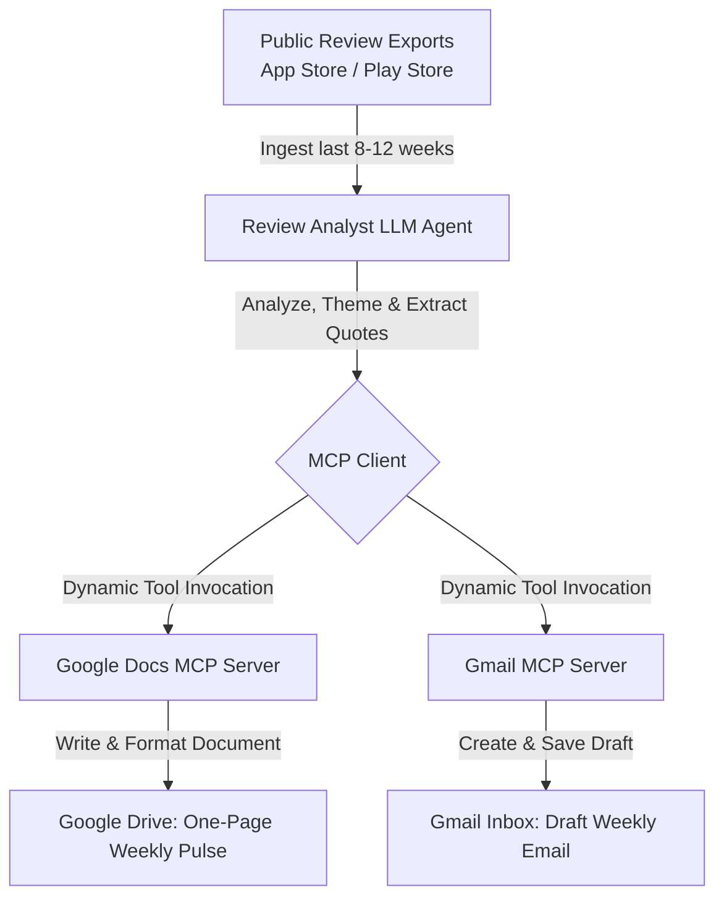

# 📈 Groww App Review Analyst & MCP Integration — Problem Statement

## 1. Background & Context
Groww is one of India's largest and fastest-growing financial services platforms, offering millions of users the ability to invest in Mutual Funds, Stocks, ETFs, IPOs, and complete UPI transactions. With such a massive user base, the mobile application (App Store and Google Play Store) is the primary gateway for user interaction. 

However, this high volume also generates thousands of user reviews daily. A sudden spike in negative reviews often points to critical, real-time bottlenecks:
* **KYC & Onboarding:** Stalled verifications, document upload errors, or failed signatures.
* **Payments & Transactions:** Failed UPI transfers, delayed Netbanking deposits, or incorrect wallet deductions.
* **Mutual Funds & Portfolios:** Missing NAV updates, synchronization issues between Groww and external fund houses, or incorrect balance calculations.
* **System Operations:** Unexpected app crashes, latency, or login failures during market opening hours.

Manually tracking, categorizing, and summarizing these reviews is highly inefficient for Product, Growth, and Customer Success teams. There is an urgent need to automate this process to capture a **Weekly Health Pulse** and draft actionable next steps immediately.

---

## 2. Objective
Design and build an **AI-powered App Review Analyst Agent** that automatically ingests, cleans, and summarizes the last **8–12 weeks of Groww review data**. 

Crucially, instead of writing custom integrations using raw REST APIs (e.g., standard Google Docs SDKs or Gmail APIs with complex OAuth2 credential handling), this system must natively leverage the **Model Context Protocol (MCP)**. The AI agent will interact with the external world strictly through **standardized MCP servers**:
1. **Google Docs MCP Server:** To write, format, and structure a weekly "one-page pulse" document.
2. **Gmail MCP Server:** To automatically draft and prepare a weekly briefing email directly to the product team with the summary and Google Doc reference.

---

## 3. Who This Helps
* **Product & Growth Teams:** Gain rapid insight into broken features, onboarding drop-offs, and critical bugs to prioritize the weekly engineering backlog.
* **Customer Support & Success Leads:** Identify systemic user complaints, enabling proactive help center updates and coordinated support responses.
* **Leadership & Stakeholders:** Access a quick, highly digestible weekly health status without wading through raw App Store data.

---

## 4. System Core Workflow (Powered by MCP)

### Milestone Steps:
1. **Data Ingestion & Cleaning:**
   * Import historical reviews spanning the last **8–12 weeks** containing fields: `rating`, `title`, `text`, and `date`.
   * Pre-filter the raw text to ensure absolute compliance with **PII constraints** (removing all user names, email addresses, phone numbers, or account IDs).
2. **Thematic Categorization:**
   * Leverage the LLM to group reviews dynamically into a maximum of **5 major themes** (e.g., *KYC/Onboarding*, *Payments*, *Mutual Funds*, *Trading UI*, *System Stability*).
3. **Weekly Pulse Generation (via Google Docs MCP):**
   * Synthesize a highly scannable, single-page summary (restricted to **≤ 250 words**).
   * The summary must contain:
     * **Top 3 recurring themes** identified in the recent reviews.
     * **3 direct user quotes** (highly illustrative of these themes, free of PII).
     * **3 actionable product ideas / interventions** to address the feedback.
   * Direct the AI Agent to format and append this weekly summary into a dedicated Google Doc via the **Google Docs MCP Server**.
4. **Executive Notification (via Gmail MCP):**
   * Draft a professional email containing the weekly pulse note and a link to the generated Google Doc.
   * Send the email draft directly to the user's/team's alias utilizing the **Gmail MCP Server**.

---

## 5. Why Model Context Protocol (MCP) Over Traditional APIs?
The Model Context Protocol (MCP) represents a paradigm shift in how AI applications are built:
* **Standardization:** Developers define server tools once, and any LLM can discover and use them. This replaces writing ad-hoc, complex Python API code for every new integration.
* **Decoupled Security & Auth:** Token refresh, API endpoints, and scopes are managed transparently by the host running the MCP server, isolating the core LLM Agent from auth credentials and protocol shifts.
* **Native Tool Usage:** The LLM receives standard JSON schemas of tools available on the Google Docs and Gmail MCP servers, enabling it to act as an agent that natively "clicks" and "updates" the external world.

---

## 6. Key Constraints
* **Use Public Data Only:** No web scraping behind private login walls; rely solely on public Play Store / App Store exported dumps.
* **Strict Theme Cap:** Categorizations must not exceed **5 themes** to prevent cognitive overload.
* **Length Restriction:** The final generated pulse note must be highly scannable and **under 250 words**.
* **Zero PII Leakage:** Ensure no customer usernames, email addresses, device details, or transactional IDs appear in the Google Doc or Gmail draft.
